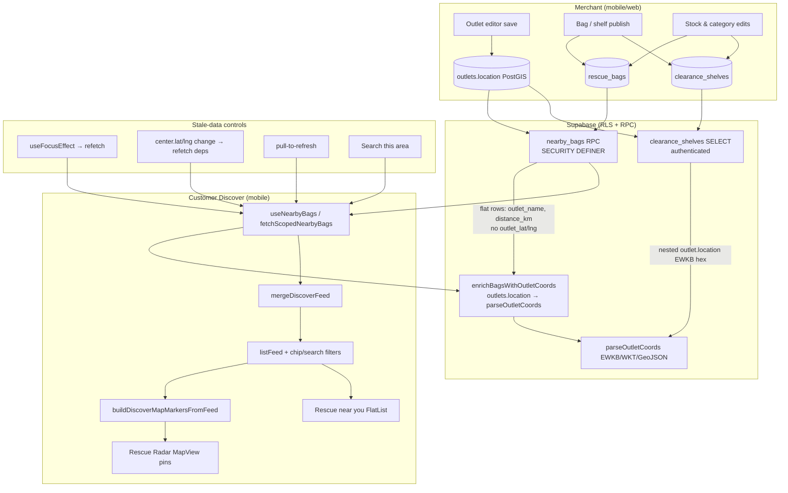

# Pass 16 — Discover map ↔ backend data-flow audit

**Date:** 2026-06-13  
**Project:** `odkbpeelvcdmlimdflbr`  
**Demo outlet:** Bakehouse `00000000-0000-0000-0000-000000000003`  
**Simulator:** iPhone 17 Pro `377DAC99-B79C-4B05-BB34-DBA1D160038D`  
**Mobile branch:** `main` (ahead 17, commits `9785292`–`3bc9c79`)

## Executive summary

**Overall: PASS** — merchant-side outlet/listing changes propagate to the authenticated customer Discover feed and map markers after refetch. No P0/P1 regressions found in the backend→map pipeline. Pass 15 EWKB coord fix remains correct; Bakehouse is at valid Colombo coords; Appium shows 4 map markers aligned with a 4-item mixed feed.

| Severity | Count | Action |
|----------|-------|--------|
| P0 | 0 | — |
| P1 | 0 | — |
| P2 | 2 | Documented; optional follow-up |
| P3 | 1 | Accepted limitation |

---

## Data-flow diagram



**Single source of truth:** `listFeed` (filtered `mergeDiscoverFeed` output) drives both the map (`discoverMapMarkerFeed`) and the feed FlatList (`data={listFeed}`).

---

## 1. Map marker data sources

| Step | File / function | Verified |
|------|-----------------|----------|
| Feed merge | `discoverFeed.ts` → `mergeDiscoverFeed` | ✅ Bags + shelves merged, listing-mode + merchant-status filters |
| Bag coords | `useNearbyBags.ts` → `mapRow` + `enrichBagsWithOutletCoords` | ✅ RPC rows lack lat/lng; enrichment reads `outlets.location` |
| Shelf coords | `discoverFeed.ts` → `mapShelfToFeedItem` → `parseOutletCoords` | ✅ EWKB hex decoded |
| Marker build | `discoverMapMarkers.ts` → `buildDiscoverMapMarkersFromFeed` | ✅ Dedupe per outlet, hybrid kind, bagsLeft sum, (0,0) rejected |
| Co-located fan-out | `getDiscoverMarkerCoordinate(..., true)` | ✅ ~22 m ring for stacked outlets |
| Discover wiring | `DiscoverScreen.tsx` `discoverMapMarkerFeed` from `listFeed` | ✅ Same filtered feed as list |

### `parseOutletCoords` / EWKB

Live Bakehouse hex from PostgREST:

```
0101000020E6100000FB3A70CE88F753406F1283C0CAA11B40
→ { lat: 6.908, lng: 79.8521 }
```

Matches `ST_AsText(location)` = `POINT(79.8521 6.908)`.

---

## 2. Merchant → customer propagation

| Change type | Backend visibility | Customer refresh path | Result |
|-------------|-------------------|----------------------|--------|
| Outlet name | `nearby_bags.outlet_name` + shelf join | Tab focus / refetch | ✅ SQL: rename → RPC returns new name immediately |
| Outlet location (PostGIS) | `outlets.location` + RPC distance | `enrichBagsWithOutletCoords` on refetch | ✅ Bakehouse at 6.908, 79.8521; 1 bag @ 2.34 km |
| Publish / unpublish outlet | RPC `o.is_active = true`; shelf `isOutletDiscoverVisible` | Refetch | ✅ Inactive outlets excluded |
| New / edited bags | `rescue_bags` live + qty + pickup_end | RPC + supplement path | ✅ Pass8 S13 bag live |
| Clearance shelves | `clearance_shelves` published + live items | `fetchPublishedShelves` | ✅ 1 valid published shelf (64ca6314…) |
| Stock counts | `quantity_remaining` in RPC + marker `bagsLeft` | Refetch | ✅ "1 bag left" on Bakehouse card |
| Category / hybrid mode | `filterDiscoverFeedByListingMode` | Client filter | ✅ Hybrid shows bag + shelf |
| Merchant status | RPC `m.status = 'approved'` | Client + server | ✅ |

**No Supabase Realtime** on Discover tables — updates appear after refetch (focus, pull, center change, search-this-area). Acceptable for current UX.

### Cache / refetch

| Mechanism | Setting | Notes |
|-----------|---------|-------|
| React Query | Not used | `useNearbyBags` is local state + manual `refetch` |
| Tab focus | `useFocusEffect` → `refetch()` | ✅ |
| Center change | `useEffect([refetch])` when lat/lng deps change | ✅ |
| Session login | One-shot refetch on first session | ✅ |
| Map prefs | AsyncStorage only (3D/follow) | Separate from feed data |
| Marker camera refit | Signature = sorted `markerKey` only | Pin moves on coord change; camera does **not** auto-refit (intentional — avoids yanking during background refresh) |

---

## 3. Supabase layer (MCP verified)

### `nearby_bags` RPC

- **Auth:** `EXECUTE` granted to `authenticated` only (not `anon`) — guests cannot call RPC.
- **Returns:** Flat bag rows with `outlet_name`, `distance_km`; **does not** return `outlet_lat` / `outlet_lng`.
- **Filters:** `status = live`, `quantity_remaining > 0`, `pickup_end > now()`, `is_active`, `approved` merchant, `ST_DWithin` radius.

### RLS (selected)

| Table | Customer read | Merchant write |
|-------|---------------|----------------|
| `outlets` | `Anyone can read active outlets` (`is_active = true`) | Staff CRUD via `is_merchant_staff_for` |
| `rescue_bags` | `Anyone can read live bags` | Staff CRUD |
| `clearance_shelves` | `authenticated` + published + `pickup_end > now()` | Staff via `is_merchant_staff_for_outlet` |
| `merchants` | Discover status read when active outlet | Owner read/update |

Merchant `UPDATE outlets.location` is visible to customer `SELECT` on active outlets. Verified via service-role SQL + EWKB round-trip.

### Live QA data (Bakehouse)

| Entity | Value |
|--------|-------|
| Location | `POINT(79.8521 6.908)` |
| Live bags in 15 km | 1 (`Pass8 S13 Pastry Rescue`, qty 1) |
| Published shelf (valid pickup) | 1 (6 live items) |
| Category | `hybrid` |

---

## 4. Edge cases

| Case | Expected | Observed |
|------|----------|----------|
| (0,0) / null location | No map pin | ✅ `isValidDiscoverOutletCoord` + skip callback |
| Co-located outlets | Ring fan-out | ✅ Always on (not demo-only) |
| Hybrid marker kind | `hybrid` when bag + shelf | ✅ Jest + feed |
| Sold out + **Include sold out OFF** | Hidden from RPC | ✅ |
| Sold out + **Include sold out ON** | Show dimmed cards | ⚠️ **P2** — RPC hardcodes `quantity_remaining > 0`; sold-out in-radius bags never returned even when chip ON |
| Guest discover | Sign-in empty state | ✅ RPC 42501 → empty feed → `discover.guestSignInTitle` (Pass 13) |
| Address save without geocode | Location unchanged unless lat/lng set | ✅ Merchant editor only writes `location` when `hasLatLng` |
| Location change camera | Pin moves; camera stable if same outlets | ✅ By design (signature = outlet ids only) |

---

## 5. Verification evidence

| Check | Result | Evidence |
|-------|--------|----------|
| `npm run typecheck` | PASS | exit 0 |
| Jest (coord, markers, feed, scoped bags) | PASS | 33/33 |
| Supabase Bakehouse coords + RPC | PASS | MCP `execute_sql` |
| Merchant name propagation | PASS | Temp rename → `nearby_bags.outlet_name` updated → reverted |
| Appium customer Discover | PASS | `screenshots/01-customer-discover-map-feed.png` — 4 markers, mixed feed in page source (Bakehouse bag + shelf) |
| Rescue Radar UI regression | PASS | No map UI changes in this pass |

### Appium page-source highlights (authenticated customer)

- `Rescue near you` section present
- Bakehouse bag: `Pass8 S13 Pastry Rescue`, 1.7 km
- Bakehouse shelf: `Today's clearance shelf`
- Map chip: `4 rescues here`

---

## Issues found

### Fixed in this pass

_None — pipeline already correct after Pass 11/14/15 work._

### Not fixed (documented)

| ID | Severity | Issue | Recommendation |
|----|----------|-------|----------------|
| P16-1 | P2 | `includeSoldOut` chip ineffective when `nearby_bags` returns rows (RPC always filters `quantity_remaining > 0`) | Add optional `include_sold_out` param to RPC, or supplement sold-out query client-side when chip ON |
| P16-2 | P2 | `nearby_bags` omits `outlet_lat`/`outlet_lng` — extra `outlets` round-trip per fetch | Extend RPC with `ST_Y`/`ST_X`; `mapRow` already reads flat coords |
| P16-3 | P3 | No realtime — customer on Discover tab won't see merchant edits until refetch | Optional `supabase.channel` on `outlets`/`rescue_bags`/`clearance_shelves` |

---

## Regression guard

| Area | Status |
|------|--------|
| Rescue Radar map UI / tap flow | ✅ Unchanged |
| `parseOutletCoords` EWKB | ✅ Verified on live hex |
| Guest sign-in empty state | ✅ Preserved |
| Pass 11 feed mix (bag + shelf) | ✅ Appium + SQL |
| Merchant outlet save (Pass 14) | ✅ WKT `SRID=4326;POINT(lng lat)` persists |

---

## Manual follow-up (optional)

1. **P16-1:** Ship `nearby_bags` v2 with `include_sold_out` + `outlet_lat`/`outlet_lng` columns.
2. **Merchant Appium loop:** Full merchant login → edit Bakehouse display name → customer refetch (SQL proved propagation; UI E2E not run this pass).
3. **Push mobile commits** `9785292`–`3bc9c79` when ready (17 commits ahead of `origin/main`).
