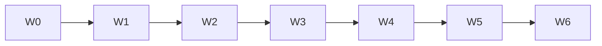

# Pass 26 — Multitask Playbook

Parent coordinator runs in **Cursor Multitask Mode**. Parent spawns background workers only; does not implement F1–F6 in foreground.

**Repo:** `/Users/kawinperera/Fresh-as-Ever`  
**Branch:** `feature/pass26-expansion` (mobile + web)  
**Sim lock:** iPhone 17 Pro `377DAC99-B79C-4B05-BB34-DBA1D160038D`  
**Runner lock:** `pass26-expansion/.runner.lock`

## Wave schedule

| Wave | Workers | Parallelism | Owns |
|------|---------|-------------|------|
| **0** | SA-BASELINE | 1 bg | Scaffold, flags, baseline SQL, MATRIX, MCP docs |
| **1** | SA-F1 .. SA-F6 | 6 bg | Migration + mobile/web code + unit tests per stream |
| **2a** | SA-F1-SQL .. SA-F6-SQL | 6 bg | Supabase pre/post SQL, RPC smoke |
| **2b** | SA-F1-WEB .. SA-F6-WEB | 6 bg | Chrome DevTools parity |
| **3** | SA-APPIUM-QUEUE | 1 bg serial | All mobile MATRIX IDs; runner lock |
| **4** | SA-CROSS-F1..F6 + SA-ADMIN + SA-WEB-INT | 8 bg | TRIANGULATION.md rows; admin + lighthouse |
| **5** | SA-FIX-{ID} | 1 bg serial | Fix + re-run failed ID (max 3 retries) |
| **6** | SA-REGRESSION + SA-AUDIT + bugbot + security | 4 bg | Pass25/24, Jest, typecheck, reviews |



## Sim lock rules

- **One Appium session** per marathon — Wave 3 only, or chained C→MBH→MK workers.
- Acquire `pass26-expansion/.runner.lock` before `pass26-expansion-runner.mjs`.
- Colombo geolocation: `6.9147, 79.8655` on every customer discover ID.
- Dismiss iOS Save Password via `appium_alert` when prompted.

## Worker return format (required)

Every subagent MUST return JSON:

```json
{
  "status": "PASS" | "PARTIAL" | "FAIL",
  "matrixIds": ["F1-M01", "..."],
  "failures": [{ "id": "F1-M01", "detail": "...", "evidence": "path" }],
  "commits": ["abc123"],
  "blockers": []
}
```

Parent appends to `verify-log.jsonl` and updates `MATRIX.md` Status/Evidence columns.

## Spawn templates

### SA-BASELINE (Wave 0)

```
You are SA-BASELINE for Pass 26 Wave 0.
Repo: /Users/kawinperera/Fresh-as-Ever
Branch: feature/pass26-expansion
Scope: scaffold pass26-expansion/, featureFlags, Supabase baseline, MATRIX 180+ rows.
Do NOT implement F1-F6 UI/migrations.
Return: {status, branch, filesCreated, baselineJson, matrixRowCount, blockers, readyForWave1}
```

### SA-F1 .. SA-F6 (Wave 1 — one message, 6 parallel)

```
You are SA-F{n} for Pass 26.
Repo: /Users/kawinperera/Fresh-as-Ever
Branch: feature/pass26-expansion
Feature flag: {FLAG_NAME} — enable locally only in worker env.
QA: see pass26-expansion/CREDENTIALS.md
MATRIX IDs: {list from MATRIX.md for Fn}
Implement migration + mobile + web + unit tests for this stream only.
Return worker JSON format.
```

### SA-F{n}-SQL (Wave 2a)

```
Supabase MCP only. project_id: odkbpeelvcdmlimdflbr
Pre/post execute_sql for {feature}. Save baseline/f{n}-post.json.
Return worker JSON format.
```

### SA-APPIUM-QUEUE (Wave 3)

```
Shell worker. Run pass26-expansion-runner.mjs --feature f1,f2,... or ONLY_IDS=...
Lock: pass26-expansion/.runner.lock
UDID: 377DAC99-B79C-4B05-BB34-DBA1D160038D
Order: customer → qa.merchant@ → qa.kumbuk@
Return worker JSON format.
```

### SA-FIX-{ID} (Wave 5)

```
Fix root cause for MATRIX ID {ID}. Re-run only {ID} + dependency regression rows.
Max retry {n}/3. Append verify-log.jsonl.
Return worker JSON format.
```

## Perfection loop

`pass26-perfection-loop.mjs` reads `results.json` failures → spawns SA-FIX serially (or parent Task tool in Multitask Mode):

```
while (matrix.hasFailures() && retryCount <= 3) {
  spawn SA-FIX-{id}
  re-run failed + upstream regression IDs
  append verify-log.jsonl
}
```

## Parent rules

- Batch independent workers in **one message**.
- End turn after spawn; merge on completion notification.
- `TodoWrite merge=true` as workers close scope.
- `SetActiveBranch feature/pass26-expansion` when branch created.
- Do not push until user approves and MATRIX all PASS.

## MCP assignment summary

See [MCP-USAGE.md](./MCP-USAGE.md).
